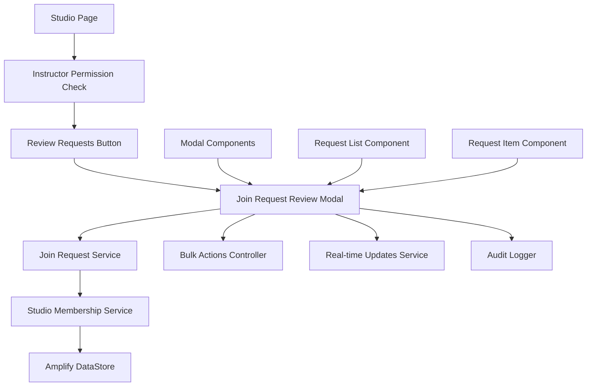
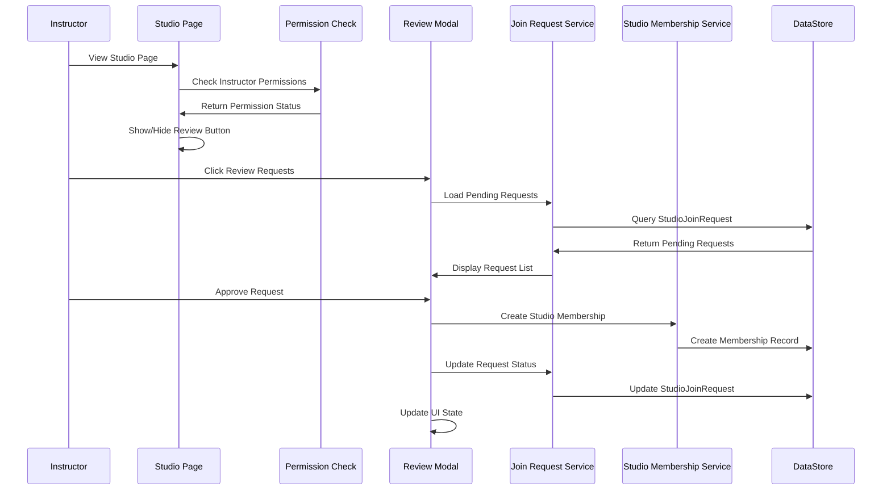

# Design Document: Instructor Join Request Review Modal

## Overview

The Instructor Join Request Review Modal provides a comprehensive interface for studio instructors to manage pending membership requests. This modal integrates with the existing studio membership system and leverages the current StudioJoinRequest data model to provide real-time request management capabilities.

The design builds upon the existing studio membership architecture, utilizing the StudioMembershipService and extending the studio page with instructor-specific functionality. The modal provides both individual and bulk request processing capabilities with comprehensive audit logging.

## Architecture

### High-Level Architecture



### Component Interaction Flow



## Components and Interfaces

### New Components

#### 1. InstructorJoinReviewModalComponent
```typescript
interface InstructorJoinReviewModalComponent {
  studioId: string;
  pendingRequests: StudioJoinRequest[];
  selectedRequests: Set<string>;
  isLoading: boolean;
  error: string | null;
  
  // Methods
  loadPendingRequests(): Promise<void>;
  approveRequest(requestId: string): Promise<void>;
  rejectRequest(requestId: string, feedback?: string): Promise<void>;
  bulkApprove(requestIds: string[]): Promise<void>;
  bulkReject(requestIds: string[], feedback?: string): Promise<void>;
  toggleRequestSelection(requestId: string): void;
  closeModal(): void;
}
```

#### 2. JoinRequestService
```typescript
interface JoinRequestService {
  getPendingRequestsForStudio(studioId: string): Promise<StudioJoinRequest[]>;
  approveJoinRequest(requestId: string, reviewedBy: string): Promise<void>;
  rejectJoinRequest(requestId: string, reviewedBy: string, feedback?: string): Promise<void>;
  subscribeToRequestUpdates(studioId: string): Observable<StudioJoinRequest[]>;
  getRequestAuditLog(requestId: string): Promise<RequestAuditEntry[]>;
}
```

#### 3. InstructorPermissionService
```typescript
interface InstructorPermissionService {
  isInstructor(studioId: string, userId: string): Promise<boolean>;
  canManageRequests(studioId: string, userId: string): Promise<boolean>;
  subscribeToPermissionChanges(studioId: string, userId: string): Observable<boolean>;
}
```

### Enhanced Existing Components

#### Updated StudioPage
```typescript
interface StudioPageEnhancements {
  // New properties
  canReviewRequests: boolean;
  pendingRequestCount: number;
  
  // New methods
  checkInstructorPermissions(): Promise<void>;
  openJoinRequestReviewModal(): Promise<void>;
  refreshPendingRequestCount(): Promise<void>;
}
```

#### Extended StudioJoinRequest Model
```typescript
interface EnhancedStudioJoinRequest extends StudioJoinRequest {
  // Existing fields from Amplify model
  id: string;
  studioId: string;
  userId: string;
  userName: string;
  userEmail: string;
  requestedAt: Date;
  status: 'pending' | 'approved' | 'rejected' | 'cancelled';
  message?: string;
  reviewedBy?: string;
  reviewedAt?: Date;
  reviewMessage?: string;
  
  // Computed fields for UI
  isSelected?: boolean;
  isProcessing?: boolean;
  userProfile?: UserProfile;
}
```

## Data Models

### New Interfaces

#### RequestAuditEntry
```typescript
interface RequestAuditEntry {
  id: string;
  requestId: string;
  action: 'created' | 'approved' | 'rejected' | 'cancelled';
  performedBy: string;
  performedByName: string;
  performedAt: Date;
  details?: string;
  previousStatus?: string;
  newStatus?: string;
}
```

#### BulkOperationResult
```typescript
interface BulkOperationResult {
  totalRequests: number;
  successfulOperations: number;
  failedOperations: number;
  errors: BulkOperationError[];
}

interface BulkOperationError {
  requestId: string;
  requestName: string;
  error: string;
}
```

#### ModalConfiguration
```typescript
interface JoinRequestModalConfig {
  studioId: string;
  studioName: string;
  enableBulkActions: boolean;
  enableRealTimeUpdates: boolean;
  maxRequestsPerPage: number;
  autoRefreshInterval: number;
}
```

### Database Schema Extensions

The design leverages the existing StudioJoinRequest model in Amplify, which already includes all necessary fields:

```typescript
// Existing Amplify Model (no changes needed)
StudioJoinRequest: {
  id: string;
  studioId: string;
  userId: string;
  userName: string;
  userEmail: string;
  requestedAt: datetime;
  status: enum(['pending', 'approved', 'rejected', 'cancelled']);
  message?: string;
  reviewedBy?: string;
  reviewedAt?: datetime;
  reviewMessage?: string;
}
```

## Correctness Properties

*A property is a characteristic or behavior that should hold true across all valid executions of a system-essentially, a formal statement about what the system should do. Properties serve as the bridge between human-readable specifications and machine-verifiable correctness guarantees.*

Based on the prework analysis, I'll now eliminate redundancy and create comprehensive properties:

### Property Reflection

After reviewing the prework analysis, I identified several redundant properties:
- Properties 2.2, 7.1, and 7.3 all test the same requirement about displaying requester information
- Properties 4.1 and 4.3 both test request status updates for rejection
- Properties 3.3 and 4.4 both test list filtering after status changes

I'll consolidate these into comprehensive properties that provide unique validation value.

### Correctness Properties

**Property 1: Instructor Access Control**
*For any* user and studio combination, the review requests button should be visible if and only if the user has instructor or admin membership type for that studio
**Validates: Requirements 1.1, 1.2, 1.3**

**Property 2: Permission Change Reactivity**
*For any* user whose membership type changes, the review button visibility should update immediately to reflect the new permission level
**Validates: Requirements 1.4**

**Property 3: Pending Request Filtering**
*For any* studio, the modal should display only join requests with "pending" status that belong to that specific studio
**Validates: Requirements 2.1**

**Property 4: Request Information Completeness**
*For any* displayed join request, all required fields (requester name, message, timestamp) should be present and properly formatted
**Validates: Requirements 2.2, 7.1, 7.3**

**Property 5: Request Sorting Consistency**
*For any* list of join requests, they should be sorted by submission date with the most recent requests appearing first
**Validates: Requirements 2.4**

**Property 6: Approval Workflow Completeness**
*For any* approved join request, the system should create a studio membership record, update the request status to "approved", and record the reviewing instructor
**Validates: Requirements 3.1, 3.2, 10.1**

**Property 7: Rejection Workflow Completeness**
*For any* rejected join request, the system should update the request status to "rejected", record the reviewing instructor, and optionally store feedback
**Validates: Requirements 4.1, 4.2, 10.2**

**Property 8: Status Change List Management**
*For any* join request that changes from "pending" to "approved" or "rejected", it should be immediately removed from the pending requests list
**Validates: Requirements 3.3, 4.4**

**Property 9: Bulk Operation Consistency**
*For any* set of selected requests, bulk approve/reject operations should process all selected requests with the same outcome as individual operations
**Validates: Requirements 6.3, 6.4**

**Property 10: Selection State Management**
*For any* request selection changes, the bulk action buttons should appear when requests are selected and disappear when none are selected
**Validates: Requirements 6.1, 6.2**

**Property 11: Error Handling Preservation**
*For any* failed approval or rejection operation, the request should remain in "pending" status and appropriate error feedback should be provided
**Validates: Requirements 3.5, 9.1, 9.2**

**Property 12: Real-time Update Integration**
*For any* new join request submitted while the modal is open, it should appear in the pending requests list immediately
**Validates: Requirements 8.1**

**Property 13: Audit Trail Completeness**
*For any* approval or rejection action, the system should record the action timestamp, performing instructor, and maintain immutable audit records
**Validates: Requirements 10.1, 10.2, 10.3, 10.5**

**Property 14: Profile Information Display**
*For any* join request where user profile information is available, it should be displayed; when unavailable, the system should gracefully handle the absence
**Validates: Requirements 7.2, 7.5**

**Property 15: Historical Data Preservation**
*For any* request that has been previously rejected, the rejection history should be visible when reviewing subsequent requests from the same user
**Validates: Requirements 7.4**

## Error Handling

### Error Categories

#### Permission Errors
```typescript
enum InstructorPermissionError {
  NOT_AUTHENTICATED = 'NOT_AUTHENTICATED',
  NOT_INSTRUCTOR = 'NOT_INSTRUCTOR',
  STUDIO_NOT_FOUND = 'STUDIO_NOT_FOUND',
  PERMISSION_EXPIRED = 'PERMISSION_EXPIRED'
}
```

#### Request Processing Errors
```typescript
enum RequestProcessingError {
  REQUEST_NOT_FOUND = 'REQUEST_NOT_FOUND',
  REQUEST_ALREADY_PROCESSED = 'REQUEST_ALREADY_PROCESSED',
  MEMBERSHIP_CREATION_FAILED = 'MEMBERSHIP_CREATION_FAILED',
  INVALID_REQUEST_STATUS = 'INVALID_REQUEST_STATUS',
  CONCURRENT_MODIFICATION = 'CONCURRENT_MODIFICATION'
}
```

#### Network and System Errors
```typescript
enum SystemError {
  NETWORK_ERROR = 'NETWORK_ERROR',
  DATABASE_ERROR = 'DATABASE_ERROR',
  AUTHENTICATION_ERROR = 'AUTHENTICATION_ERROR',
  RATE_LIMIT_EXCEEDED = 'RATE_LIMIT_EXCEEDED'
}
```

### Error Recovery Strategies

1. **Automatic Retry**: Network errors and transient failures
2. **User Retry**: Failed operations with retry buttons
3. **Graceful Degradation**: Show cached data when real-time updates fail
4. **Error Boundaries**: Prevent modal crashes from affecting parent page

## Testing Strategy

### Unit Testing
- **Permission Logic**: Test instructor permission checking with various membership types
- **Request Processing**: Test individual approve/reject operations
- **Bulk Operations**: Test bulk processing with mixed success/failure scenarios
- **Error Handling**: Test all error conditions and recovery mechanisms

### Property-Based Testing
- **Testing Library**: fast-check (TypeScript property-based testing library)
- **Test Configuration**: Each property test configured to run minimum 100 iterations
- **Property Test Tags**: Format: `// Feature: instructor-join-review, Property {number}: {property_text}`

Each property test will:
1. Generate random test data (users, studios, requests)
2. Verify the universal property holds across all inputs
3. Reference the specific design document property
4. Validate against the corresponding requirements

### Integration Testing
- **Modal Integration**: Test modal within Ionic framework
- **Service Integration**: Test with StudioMembershipService and Amplify
- **Real-time Updates**: Test subscription-based updates
- **Cross-component Communication**: Test studio page and modal interaction

### Manual Testing
- **Accessibility**: Keyboard navigation and screen reader compatibility
- **Responsive Design**: Various screen sizes and orientations
- **Performance**: Load time with large numbers of requests
- **User Experience**: Complete instructor workflow testing

## Implementation Notes

### Performance Considerations
1. **Lazy Loading**: Load requests only when modal opens
2. **Pagination**: Handle large numbers of requests efficiently
3. **Debounced Updates**: Prevent excessive real-time update calls
4. **Optimistic Updates**: Update UI immediately, sync with backend

### Security Considerations
1. **Server-side Validation**: All permission checks must be validated on backend
2. **Audit Logging**: All actions must be logged for accountability
3. **Rate Limiting**: Prevent abuse of bulk operations
4. **Data Sanitization**: Clean all user input before processing

### Accessibility Features
1. **Keyboard Navigation**: Full keyboard support for all actions
2. **Screen Reader Support**: Proper ARIA labels and descriptions
3. **High Contrast**: Support for high contrast themes
4. **Focus Management**: Proper focus handling in modal context