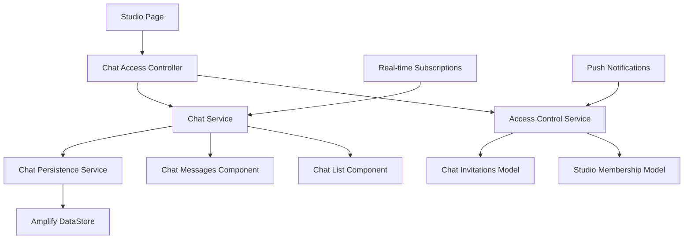
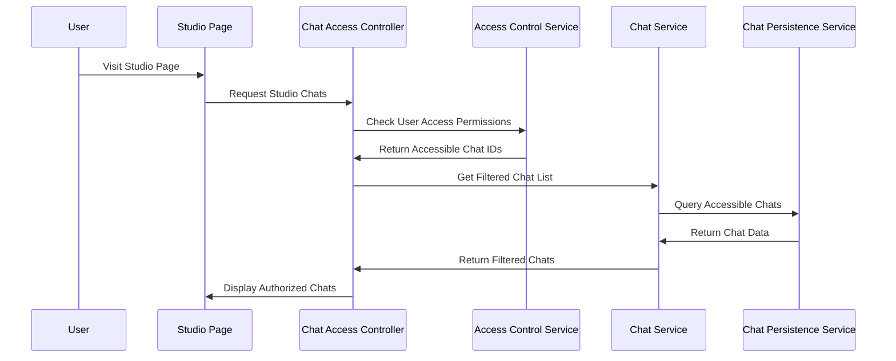

# Design Document: Studio Chat Access Control

## Overview

This design extends the existing chat system to implement granular access control for studio-based public and private chats. The current system has basic chat types (studio, private, group) but lacks proper access control mechanisms for studio-specific visibility and participation rules.

The solution builds on the existing ChatService, ChatPersistenceService, and Amplify data models while adding new access control layers, invitation management, and enhanced UI components to distinguish between public and private chats.

## Architecture

### High-Level Architecture



### Component Interaction Flow



## Components and Interfaces

### New Components

#### 1. ChatAccessController
```typescript
interface ChatAccessController {
  getStudioChatsForUser(studioId: string, userId: string): Promise<StudioChatList>;
  canUserAccessChat(chatId: string, userId: string): Promise<boolean>;
  canUserSendMessage(chatId: string, userId: string): Promise<boolean>;
  filterChatsByAccess(chats: Chat[], userId: string): Promise<Chat[]>;
}
```

#### 2. AccessControlService
```typescript
interface AccessControlService {
  checkChatAccess(chatId: string, userId: string): Promise<ChatAccessLevel>;
  inviteUserToChat(chatId: string, userId: string, invitedBy: string): Promise<ChatInvitation>;
  revokeUserAccess(chatId: string, userId: string, revokedBy: string): Promise<void>;
  getUserChatInvitations(userId: string): Promise<ChatInvitation[]>;
  acceptChatInvitation(invitationId: string): Promise<void>;
}
```

#### 3. StudioChatOrganizer
```typescript
interface StudioChatOrganizer {
  organizeStudioChats(chats: Chat[]): OrganizedStudioChats;
  separatePublicPrivateChats(chats: Chat[]): { publicChats: Chat[], privateChats: Chat[] };
  sortChatsByActivity(chats: Chat[]): Chat[];
}
```

### Enhanced Existing Components

#### Updated Chat Model
```typescript
interface Chat {
  // ... existing fields
  accessLevel: 'public' | 'private' | 'restricted';
  invitationRequired: boolean;
  studioMembershipRequired: boolean;
  createdBy: string;
  settings: EnhancedChatSettings;
}

interface EnhancedChatSettings extends ChatSettings {
  isPublic: boolean;
  requiresInvitation: boolean;
  requiresStudioMembership: boolean;
  autoApproveInvitations: boolean;
  allowGuestViewing: boolean;
}
```

#### New Data Models
```typescript
interface ChatInvitation {
  id: string;
  chatId: string;
  invitedUserId: string;
  invitedBy: string;
  invitedAt: Date;
  status: 'pending' | 'accepted' | 'declined' | 'revoked';
  expiresAt?: Date;
  message?: string;
}

interface ChatAccessLevel {
  canView: boolean;
  canRead: boolean;
  canWrite: boolean;
  canInvite: boolean;
  canManage: boolean;
  accessReason: 'public' | 'invited' | 'studio_member' | 'admin' | 'creator';
}

interface OrganizedStudioChats {
  publicChats: ChatListItem[];
  privateChats: ChatListItem[];
  invitationsPending: ChatInvitation[];
  totalPublic: number;
  totalPrivate: number;
}
```

## Data Models

### Database Schema Extensions

#### New Tables

**ChatInvitations Table**
```sql
CREATE TABLE ChatInvitations (
  id VARCHAR PRIMARY KEY,
  chatId VARCHAR NOT NULL,
  invitedUserId VARCHAR NOT NULL,
  invitedBy VARCHAR NOT NULL,
  invitedAt TIMESTAMP NOT NULL,
  status ENUM('pending', 'accepted', 'declined', 'revoked') NOT NULL,
  expiresAt TIMESTAMP,
  message TEXT,
  createdAt TIMESTAMP DEFAULT CURRENT_TIMESTAMP,
  updatedAt TIMESTAMP DEFAULT CURRENT_TIMESTAMP ON UPDATE CURRENT_TIMESTAMP,
  
  FOREIGN KEY (chatId) REFERENCES Chat(id),
  INDEX idx_invited_user (invitedUserId),
  INDEX idx_chat_invitations (chatId),
  INDEX idx_invitation_status (status)
);
```

**StudioMemberships Table** (if not exists)
```sql
CREATE TABLE StudioMemberships (
  id VARCHAR PRIMARY KEY,
  studioId VARCHAR NOT NULL,
  userId VARCHAR NOT NULL,
  membershipType ENUM('member', 'instructor', 'admin') NOT NULL,
  joinedAt TIMESTAMP NOT NULL,
  isActive BOOLEAN DEFAULT TRUE,
  
  FOREIGN KEY (studioId) REFERENCES Studio(id),
  UNIQUE KEY unique_studio_user (studioId, userId),
  INDEX idx_studio_members (studioId),
  INDEX idx_user_studios (userId)
);
```

#### Enhanced Chat Table
```sql
ALTER TABLE Chat ADD COLUMN accessLevel ENUM('public', 'private', 'restricted') DEFAULT 'public';
ALTER TABLE Chat ADD COLUMN invitationRequired BOOLEAN DEFAULT FALSE;
ALTER TABLE Chat ADD COLUMN studioMembershipRequired BOOLEAN DEFAULT FALSE;
```

### Amplify Schema Updates

```typescript
// Add to amplify/data/resource.ts
ChatInvitation: a
  .model({
    chatId: a.string().required(),
    invitedUserId: a.string().required(),
    invitedBy: a.string().required(),
    invitedAt: a.datetime().required(),
    status: a.enum(['pending', 'accepted', 'declined', 'revoked']),
    expiresAt: a.datetime(),
    message: a.string(),
  })
  .authorization((allow: any) => [
    allow.authenticated().to(['read', 'create', 'update', 'delete']),
  ]),

StudioMembership: a
  .model({
    studioId: a.string().required(),
    userId: a.string().required(),
    membershipType: a.enum(['member', 'instructor', 'admin']),
    joinedAt: a.datetime().required(),
    isActive: a.boolean().default(true),
  })
  .authorization((allow: any) => [
    allow.authenticated().to(['read', 'create', 'update', 'delete']),
  ]),
```

## Error Handling

### Access Control Errors
```typescript
enum ChatAccessError {
  CHAT_NOT_FOUND = 'CHAT_NOT_FOUND',
  ACCESS_DENIED = 'ACCESS_DENIED',
  INVITATION_REQUIRED = 'INVITATION_REQUIRED',
  MEMBERSHIP_REQUIRED = 'MEMBERSHIP_REQUIRED',
  INVITATION_EXPIRED = 'INVITATION_EXPIRED',
  INVITATION_REVOKED = 'INVITATION_REVOKED',
  ALREADY_MEMBER = 'ALREADY_MEMBER',
  INVALID_INVITATION = 'INVALID_INVITATION'
}

class ChatAccessException extends Error {
  constructor(
    public errorCode: ChatAccessError,
    public chatId: string,
    public userId: string,
    message?: string
  ) {
    super(message || errorCode);
  }
}
```

### Error Handling Strategy
- **Graceful Degradation**: Show available chats when some fail to load
- **User-Friendly Messages**: Convert technical errors to actionable user messages
- **Retry Logic**: Implement exponential backoff for transient failures
- **Offline Support**: Cache access permissions for offline scenarios

## Testing Strategy

### Unit Testing
- Test access control logic with various user/chat combinations
- Test invitation creation, acceptance, and revocation flows
- Test chat filtering and organization logic
- Test error handling for all access control scenarios

## Correctness Properties

*A property is a characteristic or behavior that should hold true across all valid executions of a system-essentially, a formal statement about what the system should do. Properties serve as the bridge between human-readable specifications and machine-verifiable correctness guarantees.*

### Property 1: Public Chat Universal Visibility
*For any* studio and any authenticated user, when the user visits that studio page, all public chats for that studio should be visible in the chat list
**Validates: Requirements 1.1**

### Property 2: Public Chat Message Access
*For any* public chat and any authenticated user, the user should be able to read all messages in that chat without access restrictions
**Validates: Requirements 1.2**

### Property 3: Public Chat Message Sending
*For any* public chat and any authenticated user, the user should be able to send messages to that chat
**Validates: Requirements 1.3**

### Property 4: Private Chat Access Control
*For any* private chat and any user, the user should only be able to access the chat if they have been explicitly invited or are the chat creator
**Validates: Requirements 2.1, 2.2, 2.3**

### Property 5: Chat Type Visibility Distinction
*For any* chat list display, public chats and private chats should be clearly distinguished with appropriate visual indicators
**Validates: Requirements 2.4, 6.2**

### Property 6: Invitation Access Grant
*For any* chat invitation, when a user accepts the invitation, they should immediately gain full access to that chat including message history from their join date forward
**Validates: Requirements 3.4, 7.1**

### Property 7: Access Revocation Immediate Effect
*For any* user with chat access, when their access is revoked, they should immediately lose all visibility and interaction capabilities for that chat
**Validates: Requirements 5.4, 7.2, 8.3**

### Property 8: Chat Creation Access Control
*For any* new private chat creation, the system should require specification of initial invited members and only allow the creator and invited members to access the chat
**Validates: Requirements 4.3, 3.1**

### Property 9: Real-time Update Access Filtering
*For any* chat message or update, real-time notifications should only be delivered to users who have current access to that chat
**Validates: Requirements 8.1, 8.4**

### Property 10: Chat List Access Filtering
*For any* user requesting a studio's chat list, the returned list should contain only chats that the user has permission to access
**Validates: Requirements 5.3, 6.5**

### Property 11: Message History Access Control
*For any* chat and any user, the visible message history should respect the user's access permissions and join date for private chats
**Validates: Requirements 7.1, 7.2, 7.3**

### Property 12: Access Control Validation Consistency
*For any* user action (view, send, invite), the system should consistently validate permissions before allowing the action
**Validates: Requirements 5.1, 5.2**

### Property 13: Chat Organization Correctness
*For any* studio chat list, chats should be correctly grouped into public and private sections and sorted by recent activity within each section
**Validates: Requirements 6.1, 6.4**

### Property 14: Invitation Management Completeness
*For any* chat admin, they should be able to invite users, revoke invitations, and remove members with immediate effect on access permissions
**Validates: Requirements 3.2, 3.5**

### Property 15: Chat Type Conversion Access Migration
*For any* chat type change from public to private, existing access should be properly migrated to invitation-based access with confirmation requirements
**Validates: Requirements 4.4, 4.5**

### Property-Based Testing
Property-based tests will validate universal correctness properties using a TypeScript property testing library like fast-check.

Each property test will run a minimum of 100 iterations and be tagged with comments referencing the design document property.

**Testing Library**: fast-check (TypeScript property-based testing library)

**Test Configuration**: Each property test configured to run minimum 100 iterations with tag format: `// Feature: studio-chat-access-control, Property {number}: {property_text}`